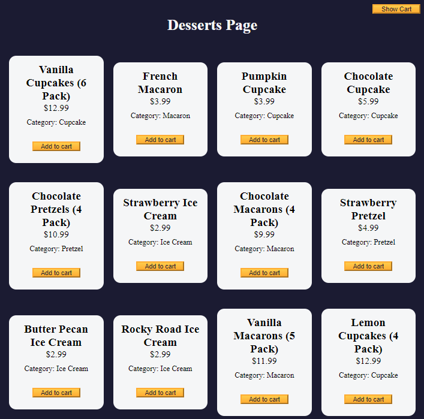

# Shopping cart.

In this shopping cart project, you will learn how to define classes and how to use them. I will create instances of classes and implement methods for data manipulation.

This project will cover concepts such as the ternary operator, the spread operator, the this keyword, and more.

[Deploy](https://lquesadam.github.io/shopping-cart/)

freeCodeCamp project